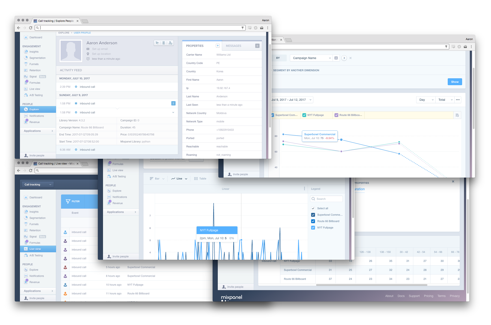

# Inbound voice call campaign tracking with Nexmo's voice API (example code)

This is the example code for the Nexmo inbound call tracking tutorial.
Please see the [Nexmo blog for the full tutorial as well as many others](https://nexmo.com/blog).

## Quick start

    git clone
    cd nexmo-flask-calltracking
    pip install -r requirements.txt
    export MIXPANEL_TOKEN="<YOUR MIXPANEL PROJECT TOKEN>"
    export NEXMO_API_KEY="<YOUR NEXMO API KEY>"
    export NEXMO_API_SECRET="<YOUR NEXMO API SECRET>"
    export FLASK_APP=app.py
    flask run

You will need to ensure that your flask server
[is available on the public internet](https://www.nexmo.com/blog/2017/07/04/local-development-nexmo-ngrok-tunnel-dr/)
and that you have a [Nexmo voice application correctly configured](https://www.nexmo.com/blog/2017/06/29/voice-application-management-easier/)

For more detailed instructions please see the blog post "Inbound voice call campaign tracking with Nexmo's voice API"
